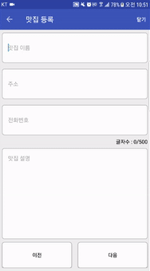
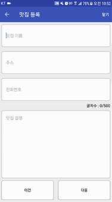

# 안드로이드 미니프로젝트 3

 

  
   
  <b>[권한 설정]</b>

 

## 1. 개요
맛집 정보를 등록하고 구글 지도에 정보를 담은 마커를 추가, sqlite를 이용해 정보를 관리하고 백그라운드 스레드로 db를 관리하는 프로젝트  

 

  
   
  <b>[실행 화면]</b>

 

## 2. 설명
* 

## 3. 사용 라이브러리
* 
